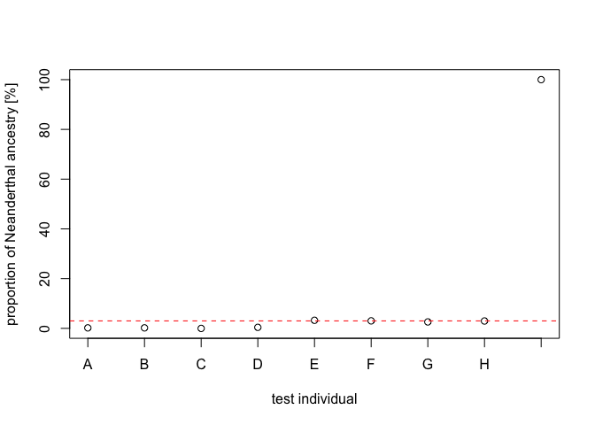

Archaic introgression exercises (February 2026)
================

**This document contains two simple exercises** for you to practice
tests of introgression (and the quantification of the amount of
introgression). **Each exercise is broken up into Tasks, which are
always highlighted in bold and intended to be solved one after
another**.

If you want to see this document with all the solutions included, click
[here](https://github.com/bodkan/ku-introgression2026/blob/main/README_solutions.md)
(but please try to solve the exercises on your own at first!). This link
takes you to a document with the exact same content as this one, except
that each R code cell has its result (numbers, tables, plots) shown
right under.

You can find the slides from the lecture
[here](https://github.com/bodkan/ku-introgression2026/blob/main/lecture.pdf)
or on the Absalon page for today’s session.

**The exercises involve a tiny bit of R programming. If you haven’t used
R before, don’t stress. Feel free to copy-paste the R code chunks I
provide below into R on your computer just as they are. The purpose of
these exercises is to think about data and to try to interpret results
(and maybe demonstrate how R is useful for very simple statistical
analyses, if you haven’t used it before), not worry about
technicalities!**

## Exercise 1: Testing introgression using the $f_4$ statistic

### Introduction

*You sequenced the genomes of four Africans and four Eurasians and got
genotypes from a single chromosome from each of them (i.e., you have the
genotypes of four African and four Eurasian chromosomes in total).
Unfortunately, there’s been a mix up in the lab and you don’t know which
one of them is African and which is Eurasian! You only know that they
are labeled A, B, C, …, H. What a disaster!*

*Fortunately, you also have genotypes from three other individuals whose
identity you know for certain and who are therefore labelled properly:
another African, a Neanderthal, and a chimpanzee. This means that you
are able to compute an* $f_4$ statistic which will test for evidence of
Neanderthal introgression in some given “test sample” $X$.

*Can you save the day and determine which of the A, B, C, …, H samples
are probably African and which are Eurasian based on the following*
$f_4$ *statistic test?*

$$f_4(\textrm{African}, X; \textrm{Neanderthal}, \textrm{Chimp}).$$

*Recall from our lecture that only Eurasians are expected to have
appreciable amounts of Neanderthal ancestry but Africans don’t. So,
hopefully, by computing this statistic for all of the mixed up samples
A, B, C, etc. (i.e., computing it for each of them in place of X, one
after another), you should be able to determine who is likely African
(these won’t show evidence of Neanderthal introgression, giving* $f_4$
*values close to zero) and who is Eurasian (these will give* $f_4$
*values significantly more negative).*

### Moving over to R

**Type `R` in your terminal or just use RStudio (better, if you have
it)** R console. You can either do this on your own laptop (I recommend
this option if you have R installed) or on the server you’ve worked on
so far. **Create a script (`File -> New File -> R Script` in RStudio, or
just create it in any other text editor) and save it as `exercise1.R`.
You’ll be writing your solutions to this exercise in that script and
executing commands (and inspecting the results) in your R console.**

#### Task: Read and inspect the genotypes of all the sequenced samples

First **read the genotype table into R**:

``` r
gt <- read.table(url("https://github.com/bodkan/ku-introgression2026/raw/main/genotypes_ex1.tsv"), sep = "\t", header = TRUE)
```

**Familiarize yourself with the data. What format does it have? What are
the columns, and what are the rows?** You can do this by running the
following R command which shows genotype information from only the first
few sites in the genome. The columns of the table should correspond to
the names of individuals (known or mismatched) as we described them in
the introduction to this exercise.

``` r
head(gt)
#>    pos African Neanderthal Chimp A B C D E F G H
#> 1  103       0           0     1 0 0 0 0 0 0 0 0
#> 2  244       1           1     0 1 1 1 1 1 1 1 1
#> 3  251       0           0     1 0 0 0 0 0 0 0 0
#> 4 1121       0           0     1 0 0 0 0 0 0 0 0
#> 5 1176       0           0     0 0 0 0 0 0 0 0 0
#> 6 1348       1           1     0 1 1 1 1 1 1 1 1
```

You can see that the `gt` data set is a plain R data frame, in which
each column contains the genotypes of that individual (`0` - ancestral
allele, `1` - derived allele). It might surprise you, but this is the
form of the genotype data we work in genomics most often!

#### Task: Count loci

**For how many loci in the genome do we have genotype data available? Do
we have data for the entire genome?**

``` r
nrow(gt)
#> [1] 1118744
```

#### Task: Count shared sites between African-Chimp, Neanderthal-Chimp, African-Neanderthal

In R, you can extract all genotypes (columns of a table) of a given
individual as a vector of values by using the `$` or `[[` subsetting
operators. For instance, this is how we can get all allele states of the
African chromosome:

``` r
gt$African

gt[["African"]]
```

A useful trick for comparing two chromosomes in their entirety is to
rely on the fact that R can perform *vectorized operations* (operations
performed on multiple elements of a vector at once). For instance, if
this gives us the genotypes of an African and Neanderthal chromosome:

``` r
gt[["African"]]

gt[["Neanderthal"]]
```

then we can find loci at which those two samples carry the same allele
with the following command. Notice that it returns either `TRUE` or
`FALSE`!

``` r
gt[["African"]] == gt[["Neanderthal"]] # this gives us TRUE/FALSE values 
```

**You can convince yourself that `TRUE` results match rows in which the
two chromosomes agree on an allele at that site.**

Another useful shortcut trick is that we can count the number of
elements which are `TRUE` (in this case, the number of matching alleles
between two chromosomes) simply using the `sum()` function like this:

``` r
# sum() treats TRUE as 1 and FALSE as 0, so we can sum everything up!
# -- this gives us the number of positions at which an African carries the same
#    allele as the Neanderthal
sum(gt[["African"]] == gt[["Neanderthal"]])
#> [1] 992377
```

So the answer to this task’s question can be computed as:

``` r
sum(gt[["African"]] == gt[["Chimp"]])
#> [1] 283017
sum(gt[["Neanderthal"]] == gt[["Chimp"]])
#> [1] 283210
sum(gt[["African"]] == gt[["Neanderthal"]])
#> [1] 992377
```

**Do the counts of allele sharing that you got make sense from a
phylogenetic point of view?** (Recall what is the phylogenetic
relationship between Africans, Eurasians, Neanderthals, and
Chimpanzees).

#### Task: Compute $f_4(\textrm{African, X; Neanderthal, Chimp})$ by substituting one of the unknown samples A-H as `X` in this equation

Above we computed alleles which *agree* between two samples.

On the other hand, this would count how many alleles are *different*
between a African and chimpanzee chromosome:

``` r
sum(gt[["African"]] != gt[["Chimp"]]) # note the != instead of ==
#> [1] 835727
```

Inside the `sum()` function we can compose multiple logical conditions
to create more complex comparison operations using the `&` operator
(which indicates the “AND” operation in mathematical logic).

Armed with this knowledge, we can compute the BABA and ABBA counts using
this bit of R code:

``` r
# let's randomly pick the first unknown sample as our X
X <- "A"

abba <- sum(
  (gt[["African"]] == gt[["Chimp"]]) &         # filters for A__A sites
  (gt[["African"]] != gt[["Neanderthal"]]) &   # filters for A_B_ sites
  (gt[[X]]         == gt[["Neanderthal"]])     # filters for _BB_ sites
)                                              # => all three filter for ABBA

baba <- sum(
  (gt[["African"]] != gt[["Chimp"]]) &         # filters for B__A sites
  (gt[["African"]] == gt[["Neanderthal"]]) &   # filters for B_B_ sites
  (gt[[X]]         == gt[["Chimp"]])           # filters for _A_A sites
)                                              # => all three filter for BABA
```

From these counts, we can get an idea about whether one or the other are
more frequently appearing in the data:

``` r
baba - abba
#> [1] -105
```

Finally, we can compute our introgression test $f_4$ statistic like
this, which simply normalizes the raw difference between BABA and ABBA
counts by how many SNPs we have in our data set:

``` r
f4_value <- (baba - abba) / nrow(gt)

f4_value
#> [1] -9.385525e-05
```

We will get to deciding whether this value is significant or not (and
how to make sense of these numbers for our example data set) shortly.

#### Task: Are ABBA or BABA sites the only ones in our data? For instance, can you find if there are any AAAB sites for the quartet $f_4(\textrm{African, X; Neanderthal, Chimp})$? Why aren’t those useful for testing the evidence of Neanderthal introgression?

``` r
X <- "A"

aaab <- sum(
  (gt[["African"]]     == gt[[X]]) &               # filters for AA__ sites
  (gt[[X]]             == gt[["Neanderthal"]]) &   # filters for _AA_ sites
  (gt[["Neanderthal"]] != gt[["Chimp"]])           # filters for __AB sites
)                                                  # => all three filter for AAAB

aaab
#> [1] 770310
```

#### Task (full solution below)

You know that if `X` is a African, you expect to see roughly the same
count of `BABA` and `ABBA` site patterns from the
$f_4(\textrm{AFR, X; NEA, Chimp})$ quartet, so the difference should “be
about zero”. **Use the code above to compute `baba`, `abba`, and
`f4_value` to for all of your mixed up samples A, B, C, …, H, and note
down the values you got for each of them. Which samples are most likely
African and which ones are Eurasian?**

- **If you are more familiar with R, compute the counts automatically in
  a loop of some kind and make a figure.**
- **If you’re not comfortable with R, feel free to run the following
  code in full and answer the question based on the results you get.**

``` r
X <- c("A", "B", "C", "D", "E", "F", "G", "H")

f4_values <- sapply(X, function(x) {
  abba <- sum(
    (gt[["African"]] == gt[["Chimp"]]) &         # filters for A__A sites
    (gt[["African"]] != gt[["Neanderthal"]]) &   # filters for A_B_ sites
    (gt[[x]]         == gt[["Neanderthal"]])     # filters for _BB_ sites
  )                                              # => all three filter for ABBA
  
  baba <- sum(
    (gt[["African"]] != gt[["Chimp"]]) &         # filters for B__A sites
    (gt[["African"]] == gt[["Neanderthal"]]) &   # filters for B_B_ sites
    (gt[[x]]         == gt[["Chimp"]])           # filters for _A_A sites
  )                                              # => all three filter for BABA
  
  (baba - abba) / nrow(gt)
})

data.frame(f4_values) # to print values in a neater table
#>       f4_values
#> A -9.385525e-05
#> B -9.474911e-05
#> C  1.251403e-05
#> D -1.993307e-04
#> E -1.592858e-03
#> F -1.480231e-03
#> G -1.268387e-03
#> H -1.452522e-03
```

``` r
plot(f4_values, xaxt = "n", xlab = "test sample", ylab = "f4(African, X; Neanderthal, Chimp)")
abline(h = 0, lty = 2, col = "red")
axis(side = 1, at = seq_along(X), labels = X)
```

<!-- -->

#### Task: **What does it mean for this test statistic to “be about zero”? What are we missing to truly use this as a statistical significance test?**

We can see that the samples A-D are consistent with an $f_4$ statistic
“value of about 0”, meaning that the BABA and ABBA counts were “about
the same”. This is what we would expect for African samples who are not
expected to be closer to a Neanderthal genome than another African.

On the other hand, samples E-H show a “much more negative value of the
$f_4$ statistic”, which is consistent with an excess of ABBA sites
compared to BABA sites – which arise with an increased sharing of
derived alleles between the sample X and a Neanderthal genome due to
introgression, just as we would expect when X is of Eurasian ancestry.

**Important:** In this simple example we’re missing confidence intervals
– those would allow us to do a proper statistical test to determine for
which samples we really cannot reject a null hypothesis of no gene flow
from Neanderthals. Having the information about confidence intervals, we
could avoid the vague and statistically unsatisfying talk about some
value being “almost zero”, and some other value being “much more
negative” than that (in this exercise we did this for simplicity). The
confidence interval for a given $f_4$ statistic would either intersect
the 0 null hypothesis or not. For an example, see Figure 3 in [this
paper](https://pmc.ncbi.nlm.nih.gov/articles/PMC6485383/#F3).

Real-world software such as
[ADMIXTOOLS](https://github.com/DReichLab/AdmixTools) computes
confidence intervals using a so-called
[bootstrap](https://en.wikipedia.org/wiki/Bootstrapping_(statistics))
procedure across windows along a genome.

------------------------------------------------------------------------

If you want to take a closer look at how the genotype data was prepared
(it was simulated!), you can see the complete code
[here](generate_genotypes.R).

## Exercise 2: Estimating the proportion of Neanderthal ancestry

### Introduction

*Having saved the day by identifying which of the A-H samples are of
African or Eurasian origin by testing which of them appear to carry
evidence of Neanderthal introgression, you now want to estimate how much
of their genome derives from the Neanderthals. In order to do this, you
need to compute a ratio of* $f_4$ *values as described in the lecture.*

*Of course, in order to compute this* $f_4$ *-ratio estimate, you will
need “another Neanderthal” genome! Luckily, we now have genomes of
several Neanderthals so this is not an issue and a local friendly
bioinformatician has already presciently merged your `gt` genotype table
from the first exercise with the genotypes of “another Neanderthal”.*

**Estimate the proportion of Neanderthal ancestry in each of your A-H
samples!**

### Moving over to R

**Create a script (`File -> New File -> R Script` in RStudio) and save
it as `exercise2.R`.** You’ll be writing your solutions to this exercise
in that script.

#### Task: Read and inspect the genotypes of all the sequenced samples

**You will be using the same genotype table as in the previous exercise,
with one additional column called `another_Neanderthal`. You can read
the new data like this:**

``` r
gt <- read.table(url("https://github.com/bodkan/ku-introgression2026/raw/main/genotypes_ex2.tsv"), sep = "\t", header = TRUE)
```

As always, **verify that the format of the data and its contents matches
what you expect:**

``` r
head(gt)
#>    pos African Neanderthal Chimp A B C D E F G H another_Neanderthal
#> 1  103       0           0     1 0 0 0 0 0 0 0 0                   0
#> 2  244       1           1     0 1 1 1 1 1 1 1 1                   1
#> 3  251       0           0     1 0 0 0 0 0 0 0 0                   0
#> 4 1121       0           0     1 0 0 0 0 0 0 0 0                   0
#> 5 1176       0           0     0 0 0 0 0 0 0 0 0                   1
#> 6 1348       1           1     0 1 1 1 1 1 1 1 1                   1

nrow(gt)
#> [1] 1118744
```

**Notice the presence of a new column called “another Neanderthal”.**

#### Task: Estimate Neanderthal ancestry proportion in samples A-H

From the lecture you know that we can get an estimate for the proportion
of Neanderthal ancestry in a sample $X$ by dividing the rate of allele
sharing between $X$ and a Neanderthal genome (one $f_4$ statistic) by
the rate of allele sharing expected between two Neanderthals (another
$f_4$ statistic).

To do this, we can take the $f_4$ values you computed in Exercise 1 for
all samples A-H, and divide those values by
$f_4(\textrm{African, another Neanderthal; Neanderthal, Chimp})$ (which
we can do with the new set of genotypes `gt`):

``` r
# we can compute the f4 values for everyone (A-H samples as well as
# "another_neanderthal") using the same code as above
X <- c("A", "B", "C", "D", "E", "F", "G", "H",
       "another_Neanderthal") # <---- we added this to our loop

f4_values <- sapply(X, function(x) {
  abba <- sum(
    (gt[["African"]] == gt[["Chimp"]]) &         # filters for A__A sites
    (gt[["African"]] != gt[["Neanderthal"]]) &   # filters for A_B_ sites
    (gt[[x]]         == gt[["Neanderthal"]])     # filters for _BB_ sites
  )                                              # => all three filter for ABBA
  
  baba <- sum(
    (gt[["African"]] != gt[["Chimp"]]) &         # filters for B__A sites
    (gt[["African"]] == gt[["Neanderthal"]]) &   # filters for B_B_ sites
    (gt[[x]]         == gt[["Chimp"]])           # filters for _A_A sites
  )                                              # => all three filter for BABA
  
  (baba - abba) / nrow(gt)
})


# to arrive at the estimate of Neanderthal ancestry, we divide f4 values for
# samples A-H by f4 value comparing the two Neanderthals
proportions <- f4_values / f4_values["another_Neanderthal"]

data.frame(proportions) # to print values in a neater table
#>                       proportions
#> A                    0.0019108280
#> B                    0.0019290264
#> C                   -0.0002547771
#> D                    0.0040582348
#> E                    0.0324294813
#> F                    0.0301364877
#> G                    0.0258234759
#> H                    0.0295723385
#> another_Neanderthal  1.0000000000
```

#### Task: Plot the estimated proportions of Neanderthal ancestry

**How much Neanderthal ancestry did you estimate in Africans vs
Eurasians? Do those numbers fit what you’ve learned from the lecture?**

To make the results clearer to see, let’s visualize them:

``` r
plot(proportions[-length(proportions)] * 100, xaxt = "n",
     xlab = "test individual", ylab = "proportion of Neanderthal ancestry [%]",
     ylim = c(0, 10))
abline(h = 3, lty = 2, col = "red")
axis(side = 1, at = seq_along(X), labels = X)
```

<!-- -->

#### Task: **Why didn’t we plot the proportion of Neanderthal ancestry in the very last item of the `proportions` variable? What does that last element of the vector `proportions` contain and why?**

By definition, the “proportion of Neanderthal ancestry in ‘another
Neanderthal’” is 100%, which would make the plot hard to interpret. We
use this proportion in “another Neanderthal” only to establish a
statistical baseline of “how much Neanderthal is a Neanderthal expected
to be”, but not as a real data point of interest:

``` r
plot(proportions * 100, xaxt = "n",
     xlab = "test individual", ylab = "proportion of Neanderthal ancestry [%]",
     ylim = c(0, 100))
abline(h = 3, lty = 2, col = "red")
axis(side = 1, at = seq_along(X), labels = X)
```

<!-- -->

------------------------------------------------------------------------

If you want to take a closer look at how the genotype data was prepared
(it was simulated!), you can see the complete code
[here](generate_genotypes.R).
